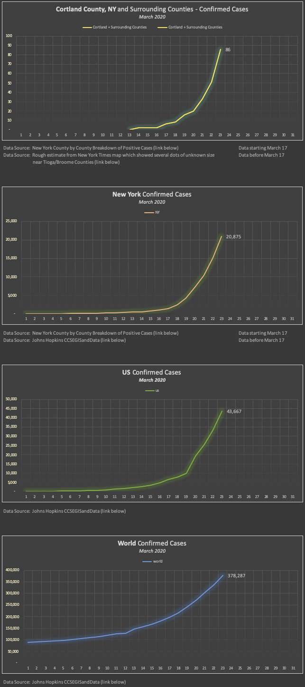
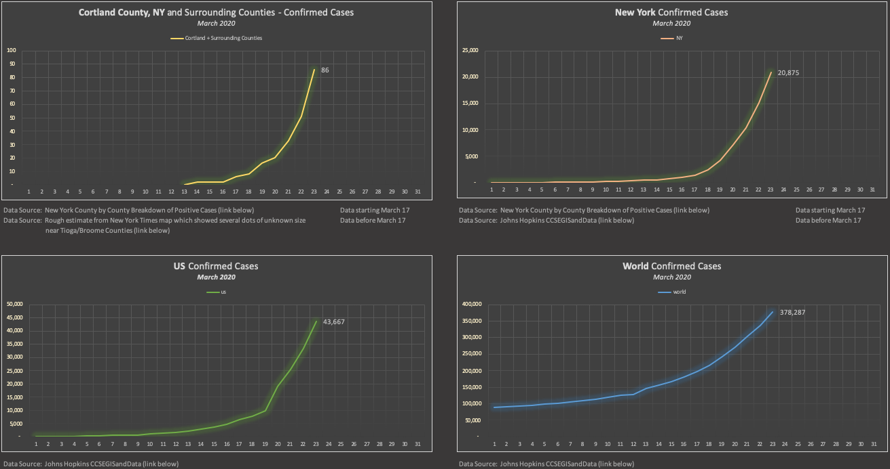

Coronavirus COVID-19 Confirmed Cases

    
Last updated: March 23, 2020  3:03pm ET

    

      Display: auto | 
      wide | 
      narrow 
    

    

        <picture>
            <source srcset="graphs/2020-03-23_world-us-ny-cortland_confirmed_cases_graphs_narrow.png" media="(max-width: 1350px)" />
            <source srcset="graphs/2020-03-23_world-us-ny-cortland_confirmed_cases_graphs.png">
            
        </picture>
    

    

        
    

    

        
    
  

  

    

    Links to data sources:
    <ul>
      <li>New York county graph:
        <ul>
          <li>after March 17: <a href="https://coronavirus.health.ny.gov/county-county-breakdown-positive-cases" target="_blank">New York County by County Breakdown of Positive Cases</a></li>
          <li>before March 17: <a href="https://www.nytimes.com/interactive/2020/world/coronavirus-maps.html#us" target="_blank">New York Times map</a> (rough estimate)</li>
        </ul></li> 
      <li>New York state graph:
        <ul>
          <li>after March 17: <a href="https://coronavirus.health.ny.gov/county-county-breakdown-positive-cases" target="_blank">New York County by County Breakdown of Positive Cases</a></li>
          <li>before March 17: <a href="https://github.com/CSSEGISandData/COVID-19/tree/master/csse_covid_19_data/csse_covid_19_daily_reports" target="_blank">Johns Hopkins CCSEGISandData</a></li>
        </ul></li> 
      <li>World and US graphs: 
        <ul>
          <li>end of day data: <a href="https://github.com/CSSEGISandData/COVID-19/tree/master/csse_covid_19_data/csse_covid_19_daily_reports" target="_blank">Johns Hopkins CCSEGISandData</a></li>
          <li>during the day data: <a href="https://gisanddata.maps.arcgis.com/apps/opsdashboard/index.html?fbclid=IwAR10wt9a2d778FvxQ1MOg_qw5aL80ypVBRVkb-ouk233xEQxuXC6c9XHSGY#/bda7594740fd40299423467b48e9ecf6" target="_blank">Johns Hopkins map</a></li>
        </ul></li> 
      <li><a href="https://github.com/elrayle/elrayle.github.io/blob/master/covid19/data" target="_blank">Consolidated data</a> from these sources driving the graphs on this site</li>
    </ul>
    

  

