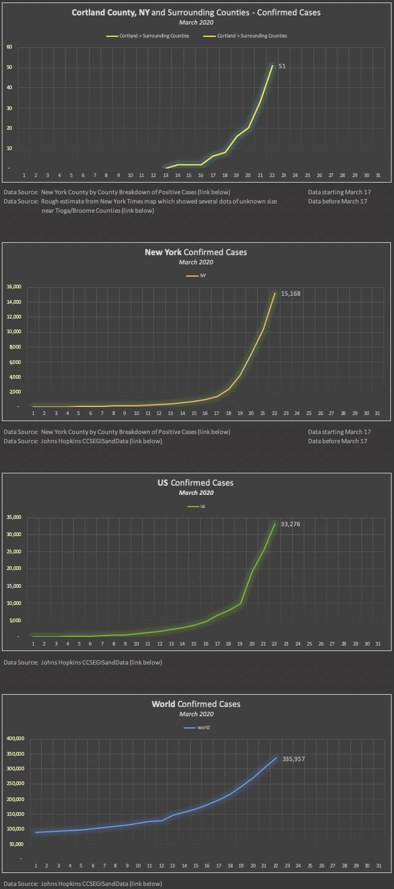

Coronavirus COVID-19 Confirmed Cases

    
Last updated: March 22, 2020  2:15pm ET

    <picture>
        <source srcset="graphs/2020-03-22_world-us-ny-cortland_confirmed_cases_graphs_narrow.png" media="(max-width: 1500px)" />
        <source srcset="graphs/2020-03-22_world-us-ny-cortland_confirmed_cases_graphs.png">
        
    </picture>

Links to data sources:
<ul>
  <li>World and US graphs: 
    <ul>
      <li>end of day data: <a href="https://github.com/CSSEGISandData/COVID-19/tree/master/csse_covid_19_data/csse_covid_19_daily_reports" target="_blank">Johns Hopkins CCSEGISandData</a></li>
      <li>during the day data: <a href="https://gisanddata.maps.arcgis.com/apps/opsdashboard/index.html?fbclid=IwAR10wt9a2d778FvxQ1MOg_qw5aL80ypVBRVkb-ouk233xEQxuXC6c9XHSGY#/bda7594740fd40299423467b48e9ecf6" target="_blank">Johns Hopkins map</a></li>
    </ul></li> 
  <li>New York state and county graphs: <a href="https://coronavirus.health.ny.gov/county-county-breakdown-positive-cases" target="_blank">New York County by County Breakdown of Positive Cases</a></li>
    <ul>
      <li>after March 17: <a href="https://coronavirus.health.ny.gov/county-county-breakdown-positive-cases" target="_blank">New York County by County Breakdown of Positive Cases</a></li>
      <li>before March 17: <a href="https://www.nytimes.com/interactive/2020/world/coronavirus-maps.html#us" target="_blank">New York Times map</a> (rough estimate)</li>
    </ul></li> 
  <li><a href="https://github.com/elrayle/elrayle.github.io/blob/master/covid19/data" target="_blank">Consolidated data</a> from these sources driving the graphs</li>
</ul>

